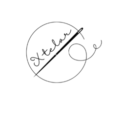
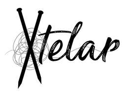
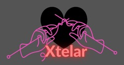
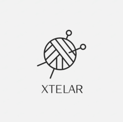
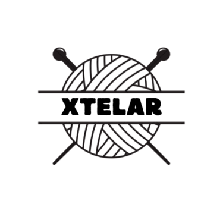

**Índice**

- [Inicio de ideas](#inicio-de-ideas)
  - [Brainstorming](#brainstorming)
  - [Idea de negocio](#idea-de-negocio)
  - [Descripción del producto](#descripción-del-producto)
  - [Marca](#marca)
    - [Nombre comercial](#nombre-comercial)
    - [Logotipo](#logotipo)
      - [Logo final](#logo-final)
  - [Localización](#localización)
  - [DAFO](#dafo)
  - [Fuerzas Porter](#fuerzas-porter)
- [Realización](#realización)

---

# Inicio de ideas

Inicio del Proyecto con un Brainstorming.

---

## Brainstorming

- En las paradas de bus/metro, una aplicación con el tráfico a tiempo real.
- Red social musical.
- App que unifique servicios de streaming.
- Cuaderno con anillas de diferente formas/personalizables.
- Herramienta de personalización de patrones de tejer.
- App de reconocimiento facial de actores.

---

## Idea de negocio

Es una aplicación web, que presta una ayuda con los patrones a la hora de tejer.

Automatiza el proceso para realizar un tejido con un patrón específico ahorrando tiempo y errores al tener que realizar la prenda y tener que rehacerla pero con distinto tamaño.

---

## Descripción del producto

Consta de una página web y una revista mensual.

- Web:
  - La herramienta de personalización.
  - Un repositorio de patrones (ropa, hogar, accesorios, regalos, muñecos...).
  - Una red social.
  - Un acceso premium (de pago).
- La revista:
  - Un código promocional para el acceso a premium.
  - Un pequeño regalo.
  - Un apartado de moda de temporada.
  - Curiosidades sobre este sector.
  - Técnicas para aprender.
  - Primeros pasos para iniciarse.

---

## Marca

El nombre de la marca 'XTELAR' es una invención derivada de nombres de constelaciones que al intentar pensar en un nombre, salieron nombres parecidos a constelaciones, de ahí nos dimos cuenta que había una fuerte compatibilidad con nuestro producto.

### Nombre comercial

El nombre comercial es una derivación a su vez del nombre de la marca, juntando proyecto con 'XTELAR', saliendo así 'PROJECTELAR'.

---

### Logotipo

Prototipos de logos pensados por su estilo y lo que transmiten.

|   |  |
|:-------------------------:|:-------------------------:|
|  |  |

---

#### Logo final

Logo elegido debido a su diseño sencillo, replicable e identificable. Con cierto aire de modernidad sin perder la elegancia y simplicidad a la vez que... 

## Localización
Al ser una empresa con pocos integrantes, nos decantamos por un alquiler de coworking en lugar de alquilar unas oficinas ya que nos repercutirían mas gastos. 
Puntos que hemos tenido en cuenta a la hora de elegir el Coworking.
- Comunicación de Transporte publico.
- Espacios del Coworking.
- Precio asequible.
- ...

Ubicación: 
Local: 
Precio:
Ventajas:

## DAFO

Aquí va el DAFO realizado en clase

## Fuerzas Porter

Aquí va el ejercicio de las fuerzas Porter realizado en clase

# Realización

Los promotores de esta aplicación son:

- Ian Burford
- Carlos Mallén
- Yulia Mudrytska
- Sandra Rupérez